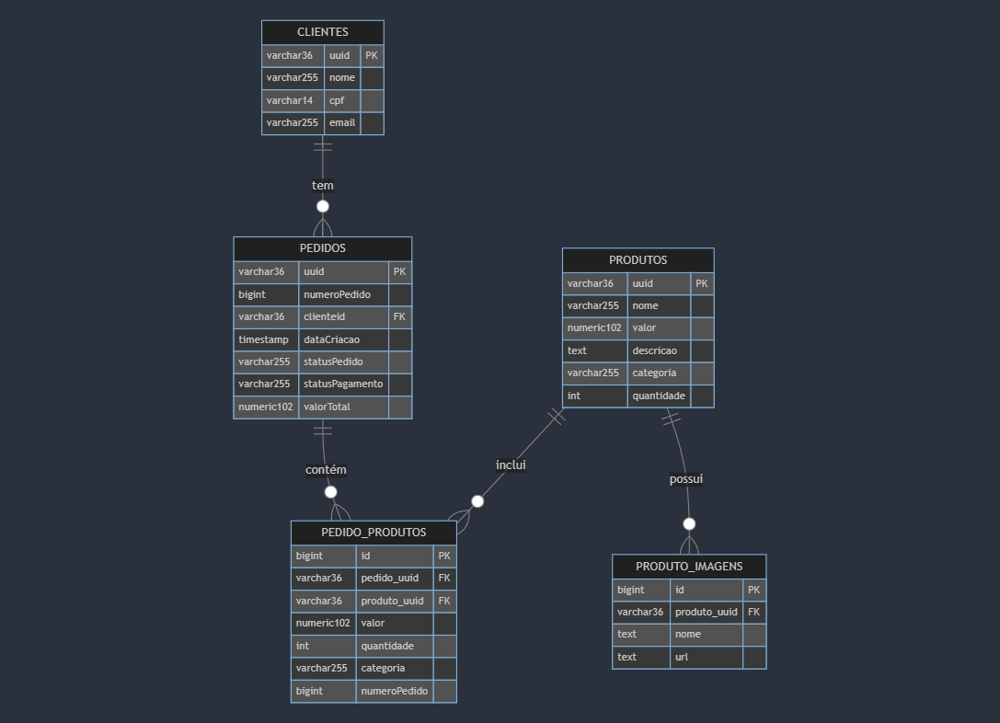

Este documento justifica a escolha do banco de dados PostgreSQL na Amazon RDS como a solução de armazenamento de dados ideal para o sistema.

## Escolha do Banco de Dados

Optamos pelo **PostgreSQL**, conhecido por sua robustez, alto desempenho e forte consistência. Como um dos sistemas de gerenciamento de banco de dados relacional (SGBDR) mais avançados e de código aberto, o PostgreSQL oferece funcionalidades de nível empresarial e extensa conformidade com padrões SQL.

### Paradigma do Banco de Dados

O PostgreSQL utiliza o paradigma **relacional** para o gerenciamento de dados. Este paradigma é baseado em um modelo teórico desenvolvido por Edgar F. Codd, no qual os dados são organizados em tabelas chamadas relações. Cada tabela é composta por linhas (registros) e colunas (atributos), e cada registro representa uma única instância de uma entidade dentro do domínio do problema. O relacionamento entre diferentes entidades é efetuado através de chaves primárias e chaves estrangeiras.

#### Aplicação do Paradigma Relacional no Projeto

Este paradigma é especialmente benéfico para o sistema de totem de autoatendimento pelas seguintes razões:

- **Normalização de Dados**: O modelo relacional facilita a normalização, que é o processo de estruturar os dados para reduzir redundâncias e dependências. Isso é crucial para manter a integridade dos dados e para a consistência das transações, assegurando que cada pedido seja processado com precisão e eficiência.

- **Flexibilidade nas Consultas**: A linguagem SQL, usada para interagir com bancos de dados relacionais, permite a realização de consultas complexas e a manipulação de grandes volumes de dados de forma eficiente. Isso é vital para gerar relatórios detalhados de vendas, preferências dos clientes e eficiência operacional.

- **Integridade Transacional**: O PostgreSQL suporta propriedades ACID (Atomicidade, Consistência, Isolamento, Durabilidade), fundamentais para garantir a integridade dos dados durante as transações internas do sistema, como atualizações de status de pedidos e alterações de inventário. Essas propriedades são essenciais para assegurar que todas as ações no sistema sejam consistentes e confiáveis, mesmo que o processamento final dos pagamentos seja gerido por uma API externa, como a do Mercado Pago.

- **Manutenção da Consistência de Dados**: A integridade referencial, um conceito chave do paradigma relacional, garante que as relações entre tabelas se mantenham consistentes. Isso é essencial para o sistema de totem, onde a integridade dos pedidos e a acurácia no status do pedido são críticas para a operação da lanchonete.

Essas características do modelo relacional se alinham perfeitamente com as necessidades do sistema, assegurando que a expansão da lanchonete seja suportada por uma base de dados robusta e confiável.

## Benefícios da Amazon RDS

A hospedagem do PostgreSQL na Amazon RDS foi escolhida devido a seus múltiplos benefícios operacionais e estratégicos:

- **Escalabilidade Automática**: Capacidade de ajustar dinamicamente os recursos computacionais e de armazenamento conforme necessário, sem interrupção do serviço, apoiando o crescimento contínuo do negócio.
- **Alta Disponibilidade e Recuperação de Desastres**: Com o recurso de Multi-AZ, a RDS garante redundância e failover automático, essencial para manter o sistema operacional 24/7.
- **Segurança Aprimorada**: Inclui recursos como grupos de segurança, sub-redes privadas dentro de uma VPC e criptografia de dados em repouso e em trânsito, proporcionando um ambiente seguro para dados sensíveis e transações financeiras.
- **Manutenção Simplificada**: Automatiza tarefas como backups, atualizações de sistema e monitoramento, permitindo que a equipe técnica se concentre em melhorar o desempenho e funcionalidades do sistema de pedidos.
- **Monitoramento e Performance Insights**: Ferramentas integradas para monitoramento e análise de desempenho, permitindo otimizações baseadas em dados reais de uso.

## Conclusão

A combinação de PostgreSQL com Amazon RDS fornece uma base de dados poderosa e flexível para nosso sistema, capaz de suportar altas demandas e expansão contínua do negócio. Esta infraestrutura não apenas atende às necessidades imediatas de gerenciamento eficiente de pedidos mas também é escalável para acompanhar o crescimento futuro, melhorando significativamente a eficiência operacional e a satisfação do cliente.

## Diagrama de Entidade-Relacionamento

